# Capstone Report — Calibrated Forecast Backtesting

**A multi-model time series benchmark with walk-forward validation and calibrated prediction intervals.**

| | |
|---|---|
| **Programme** | Time Series Forecasting for AI Systems (السلاسل الزمنية والتنبؤ) — SDAIA Academy, three-day specialist capstone module |
| **Cohort / session dates** | Course materials dated **2026-09-12** — the course repository's own commit date, and the date encoded in the seed its dataset generator uses (`SEED = 20260912`). Submissions for this cohort close 16 September 2026, 13:00 GMT+3; this capstone was built and submitted in **September 2026**. |
| **Repository** | https://github.com/Abdullah-FZN/calibrated-forecast-backtesting |
| **SDAIA Academy** | https://github.com/SDAIAAcademy |
| **Course repository** | https://github.com/MohammadYusif/time-series-forecasting-ai-systems |

> **This report is generated, not typed.** Every number, ranking and
> calibration verdict below is read from `report_data.json` and
> `outputs/tables/*.csv` by [`build_report.py`](build_report.py). The prose
> frames and interprets; it never states a figure the run did not produce.
>
> Run: 2026-09-15T20:01:42+00:00 · Python 3.13.0 · pandas 2.3.3 ·
> statsmodels 0.15.0 · LightGBM 4.7.0 ·
> Prophet 1.4.0 · sktime 1.1.0 ·
> seed 20260912 · pipeline wall time 1259.9s
>
> **All four datasets are synthetic**, generated by the course's seeded
> `data/generate_series.py`. Every result describes those synthetic series —
> not any real retailer, employer, or government indicator.

---

## The short version

| Dataset | Most accurate | Score | vs. seasonal-naive, same folds | Recommended to deploy | Its coverage / width |
|---|---|---|---|---|---|
| `retail` | **Prophet** | MASE 0.348 | 31% better than naive | Prophet — *no model here was calibrated; this is the most accurate one, on point error alone* | 100.0% / 74.3% |
| `workforce` | **ETS / Holt-Winters** | MASE 1.055 | 21% better than naive | **ETS / Holt-Winters** | 90.7% / 24.9% |
| `economic` | **SARIMA** | MASE 0.379 | 65% better than naive | **sktime Theta** | 88.9% / 13.2% |
| `intermittent` | **LightGBM (quantile)** | WAPE 132.51 | 17% better than naive | **SARIMA** | 91.1% / 588.6% ⚠ |

*"Recommended to deploy" is the most accurate model whose 90% interval is
actually calibrated (within ±5% of nominal). Where
that differs from "most accurate", the difference is the whole point of this
report: a sharper point forecast whose uncertainty is a fiction is not the
safer choice.*

**On 1 of the four datasets no model produced a calibrated interval at all.** Those rows fall back to the most accurate model on point error and are labelled as such — they are not endorsements of the uncertainty those models report.

**Width warning (⚠).** `intermittent`'s recommended model (SARIMA) reports a band averaging 589% of the series' own mean level. An interval that wide achieves its coverage by being uninformative — it is calibrated in the narrow sense and close to useless in the practical one, which is precisely why width is reported beside coverage and never omitted.

**Reading MASE above 1.0 correctly.** On `workforce` the best model posts MASE 1.055 — above 1.0 — yet its MAE of 5.11 beats the seasonal-naive baseline's 6.49 on the identical folds (the baseline's own MASE is 1.339). There is no contradiction: MASE divides by the naive error measured *in sample*, on the training window, while the comparison column above is measured *out of sample*, on the scored folds. When the scored region is genuinely harder than the history that preceded it — which is precisely what a structural break makes it — every model can beat the baseline head-to-head and still score above 1.0 against the quieter past. MASE above 1.0 here means 'harder than the training period', not 'worse than naive'.

**The headline finding is that the winner changes across the four series, and
the reason it changes is legible** — history length, seasonal structure, and
sparsity each rule out different tools before accuracy is even measured.

**The second finding is about uncertainty, and it is less comfortable.** Of
76 model × dataset × window-type combinations scored,
**23 produced a 90% interval whose empirical coverage was
actually within ±5% of 90%** — 30%.
Point accuracy and interval honesty are close to independent properties here,
and a model chosen on MAE alone is chosen on half the evidence.

---

## Method

### Fold design

| Dataset | Freq | n | Folds | Horizon | Expanding min-train | Rolling train | Transform | Headline metric |
|---|---|--:|--:|--:|--:|--:|---|---|
| `retail` | D | 1,096 | 6 | 14 | 730 | 730 | boxcox | MASE |
| `workforce` | D | 731 | 20 | 14 | 451 | 365 | boxcox | MASE |
| `economic` | MS | 108 | 6 | 6 | 72 | 60 | none | MASE |
| `intermittent` | D | 731 | 8 | 14 | 500 | 365 | none | WAPE |

Every dataset is backtested **twice** — once expanding, once rolling — over the
*identical* test windows. That is a property of `common/backtest.py`'s two
split functions, and it is what makes the expanding-vs-rolling comparison a
controlled experiment instead of two unrelated backtests.

The workforce geometry is the one that had to be solved rather than chosen. Its
break sits at index 456 of
731. Because the scored region is always the
final `n_folds × horizon` rows, anything under 20 folds pushes the whole scored
region *past* the break — producing a backtest that looks fine and tests
nothing about the event the dataset exists for.

### Leakage audit

| Dataset | Prediction features invariant | Training features invariant | Features | Future values perturbed | Harness parity (max Δ) |
|---|---|---|--:|--:|--:|
| `retail` | pass | pass | 31 | 366 | 0.0e+00 |
| `workforce` | pass | pass | 29 | 280 | 0.0e+00 |
| `economic` | pass | pass | 26 | 36 | 0.0e+00 |
| `intermittent` | pass | pass | 29 | 231 | 0.0e+00 |

The audit does not take the code's word for it. It replaces the **entire
future** with different numbers, rebuilds both design matrices, and asserts
that not one feature value moves — which it cannot do if any column reached
past the forecast origin. The last column is a separate check: this project's
fold runner versus the course's own `run_backtest`, on the same baseline. A
difference of `0.0e+00` means the folds being scored here are exactly the folds
the course defines.

### What the models are, and are not, given

The moving-holiday window **is** supplied to SARIMA (`exog`), Prophet
(`holidays=`) and LightGBM (a feature column) alike — a Hijri-calendar date is
known years ahead, and denying it to some families and not others would make
the comparison unfair rather than rigorous. The **promo shocks are supplied to
nobody**: they are drawn at random in the generator with no advance signal, so
a planner standing at the forecast origin could not know them. Handing a model
a promo flag would be forecasting with tomorrow's newspaper, and the residual
error those shocks cause is a real and irreducible part of every number below.

---

## Retail — daily, 6 series, strongly seasonal

Daily units sold, 3 regions x 2 categories, 2023-2025. Multiplicative weekly + yearly seasonality, an upward trend, drifting Hijri-like holiday bumps and sporadic promo shocks, Poisson-sampled.

`1,096` observations at `D`, 2023-01-01 → 2025-12-31,
6 series in the file. Headline scale-free metric:
**MASE**. Target transform: **boxcox**.

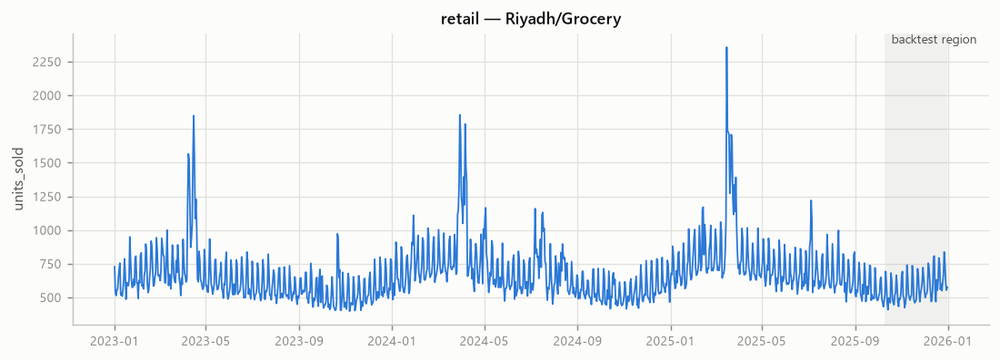
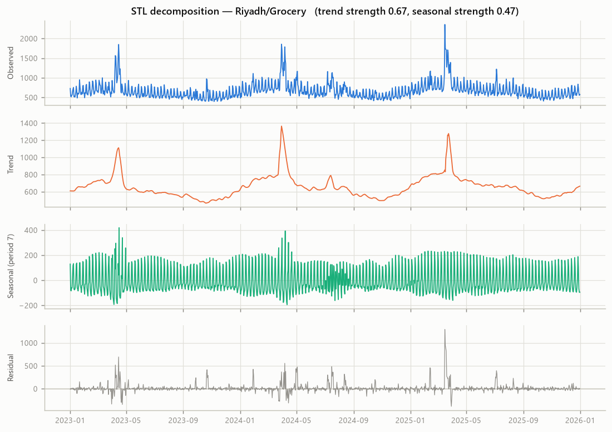
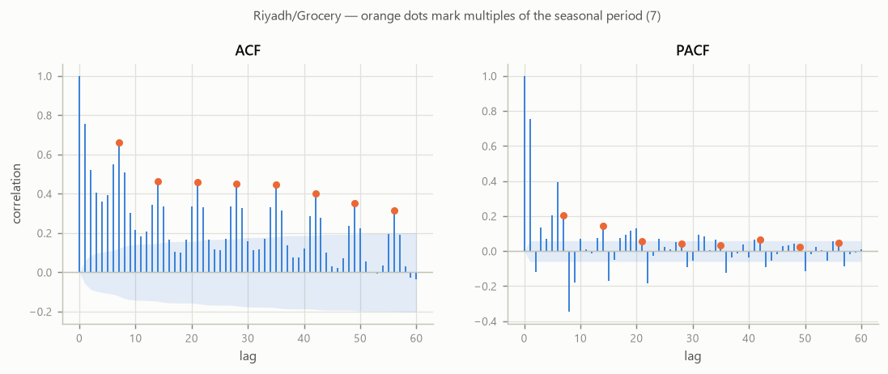
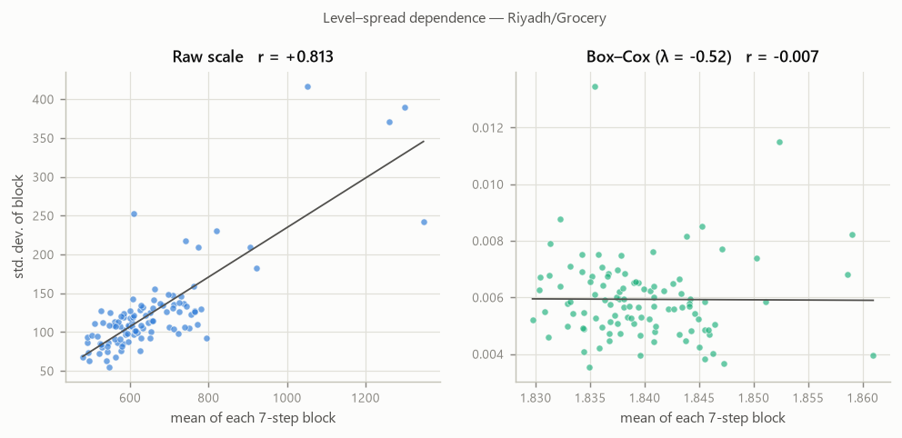

### Structure and diagnostics

- **Riyadh/Grocery (level)** → *stationary*. ADF p=0.0023 < 0.05 rejects the unit-root null, and KPSS p>=0.100 fails to reject stationarity. The two tests agree: no further differencing is needed at d=0.
- **Riyadh/Grocery (d=1)** → *stationary*. ADF p=0.0000 < 0.05 rejects the unit-root null, and KPSS p>=0.100 fails to reject stationarity. The two tests agree: no further differencing is needed at d=1.
- **Riyadh/Grocery (seasonal diff, D=1)** → *stationary*. After one seasonal difference at lag 7: ADF p=0.0000 < 0.05 rejects the unit-root null, and KPSS p>=0.100 fails to reject stationarity. The two tests agree: no further differencing is needed at d=0.

**Decomposition.** STL at period 7: trend strength 0.668, seasonal strength 0.467 (Hyndman F_T/F_S, both in [0,1]; >0.6 is a strong component). |residual| still correlates with the trend at r=0.604 under an additive decomposition versus r=0.360 under a multiplicative one, so the multiplicative form leaves less level-dependence behind. That is the empirical case for a variance-stabilising transform before fitting an additive model.

**Autocorrelation.** 34 of the first 60 ACF lags and 29 PACF lags exceed the 95% band. Both functions tail off rather than cutting off cleanly (ACF significant through lag 16, PACF through lag 10), which points at a mixed ARMA rather than a pure AR or MA -- so the order is worth selecting by AIC over a small grid rather than read off the plot. Significant ACF spikes at lag(s) [7, 14, 21, 28] -- multiples of the seasonal period 7 -- confirm seasonal structure that a non-seasonal ARIMA cannot absorb, so a seasonal term is required.

### Model results — expanding window, `Riyadh/Grocery`

| Model | Family | MAE | RMSE | WAPE % | MASE | Coverage | Width % of mean | Calibration | s / fold |
|---|---|--:|--:|--:|--:|--:|--:|---|--:|
| Prophet | GAM / framework | 30.894 | 39.895 | 5.40 | 0.348 | 100.0% | 74.3 | over-covers | 0.63 |
| LightGBM (conformal) | Tree-based ML | 32.006 | 41.217 | 5.59 | 0.361 | 97.6% | 39.8 | over-covers | 2.36 |
| LightGBM (global) | Tree-based ML | 32.481 | 42.570 | 5.67 | 0.366 | 100.0% | 294.0 | over-covers | — |
| LightGBM (quantile) | Tree-based ML | 32.922 | 40.844 | 5.75 | 0.371 | 71.4% | 16.3 | under-covers | 3.89 |
| ETS / Holt-Winters | Classical | 37.222 | 46.450 | 6.50 | 0.420 | 100.0% | 54.1 | over-covers | 0.60 |
| sktime Theta | GAM / framework | 39.035 | 48.774 | 6.82 | 0.440 | 100.0% | 57.4 | over-covers | 1.79 |
| Seasonal naive | Baseline | 44.464 | 53.699 | 7.77 | 0.502 | 100.0% | 73.8 | over-covers | 0.00 |
| SARIMA | Classical | 44.657 | 53.381 | 7.80 | 0.504 | 100.0% | 45.5 | over-covers | 20.59 |

**Residual diagnostics.** **SARIMA** passed the Ljung-Box white-noise test on 6 of 6 folds (median p = 0.984); **ETS / Holt-Winters** passed the Ljung-Box white-noise test on 0 of 6 folds (median p = 0.000). AIC selected `order=(1, 1, 2)`, `seasonal_order=(1, 1, 1, 7)` on 2 of 6 folds.

Fold-to-fold spread matters more than the mean: **SARIMA** ranged from 4.26% to 13.93% WAPE across folds (mean 7.92%, sd 3.42). A single average would have hidden that range entirely.

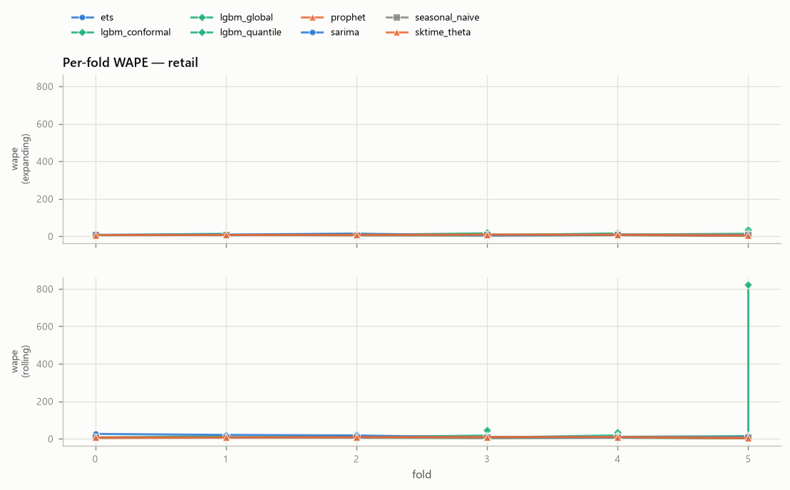
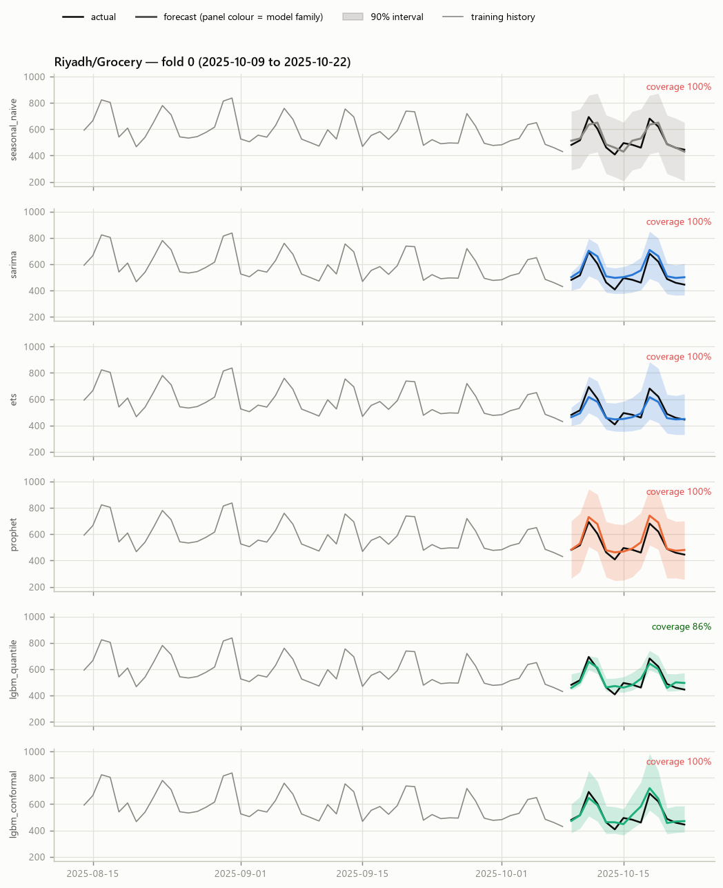
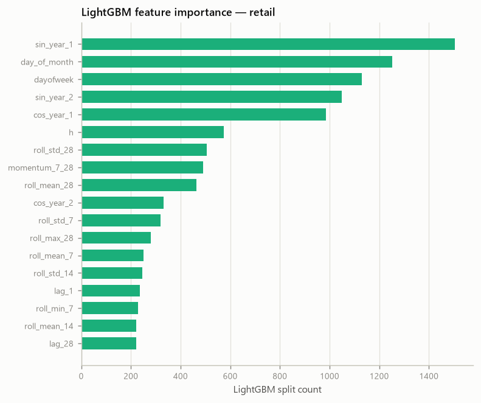

---

## Workforce — daily, one series, one structural break (2025-04-01)

Daily contact-centre headcount requirement, 2024-2025, one series, with a sustained x1.35 step-change on 2025-04-01.

`731` observations at `D`, 2024-01-01 → 2025-12-31,
1 series in the file. Headline scale-free metric:
**MASE**. Target transform: **boxcox**.

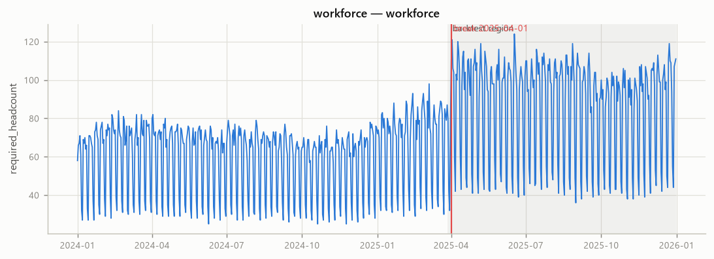
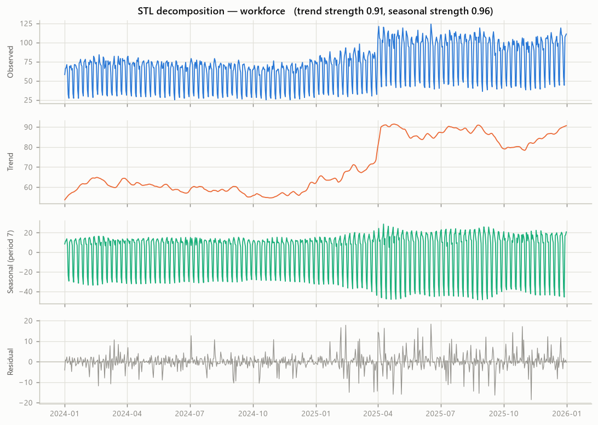
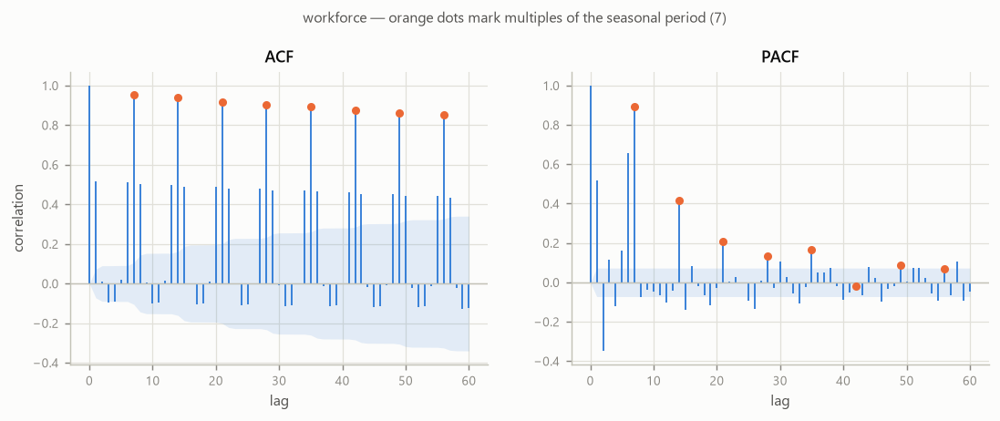
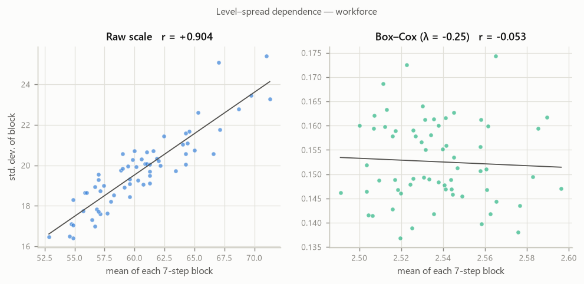

### Structure and diagnostics

- **workforce (level)** → *unit root*. ADF p=0.8790 cannot reject a unit root and KPSS p<=0.010 rejects stationarity. Both point the same way: this series needs differencing, so d >= 1.
- **workforce (d=1)** → *stationary*. ADF p=0.0000 < 0.05 rejects the unit-root null, and KPSS p>=0.100 fails to reject stationarity. The two tests agree: no further differencing is needed at d=1.
- **workforce (seasonal diff, D=1)** → *stationary*. After one seasonal difference at lag 7: ADF p=0.0000 < 0.05 rejects the unit-root null, and KPSS p>=0.100 fails to reject stationarity. The two tests agree: no further differencing is needed at d=0.

**Decomposition.** STL at period 7: trend strength 0.908, seasonal strength 0.963 (Hyndman F_T/F_S, both in [0,1]; >0.6 is a strong component). |residual| still correlates with the trend at r=0.276 under an additive decomposition versus r=0.066 under a multiplicative one, so the multiplicative form leaves less level-dependence behind. That is the empirical case for a variance-stabilising transform before fitting an additive model.

**Autocorrelation.** 27 of the first 60 ACF lags and 30 PACF lags exceed the 95% band. Both functions tail off rather than cutting off cleanly (ACF significant through lag 1, PACF through lag 8), which points at a mixed ARMA rather than a pure AR or MA -- so the order is worth selecting by AIC over a small grid rather than read off the plot. Significant ACF spikes at lag(s) [7, 14, 21, 28] -- multiples of the seasonal period 7 -- confirm seasonal structure that a non-seasonal ARIMA cannot absorb, so a seasonal term is required.

### Model results — expanding window, `workforce`

| Model | Family | MAE | RMSE | WAPE % | MASE | Coverage | Width % of mean | Calibration | s / fold |
|---|---|--:|--:|--:|--:|--:|--:|---|--:|
| ETS / Holt-Winters | Classical | 5.109 | 7.289 | 5.93 | 1.055 | 90.7% | 24.9 | **calibrated** | 0.65 |
| sktime Theta | GAM / framework | 5.218 | 7.355 | 6.06 | 1.077 | 89.3% | 26.4 | **calibrated** | 0.08 |
| SARIMA | Classical | 5.340 | 7.575 | 6.20 | 1.102 | 89.6% | 25.8 | **calibrated** | 10.96 |
| LightGBM (quantile) | Tree-based ML | 5.936 | 8.273 | 6.89 | 1.226 | 58.6% | 13.5 | under-covers | 2.90 |
| LightGBM (conformal) | Tree-based ML | 6.373 | 8.905 | 7.40 | 1.316 | 93.2% | 38.8 | **calibrated** | 2.06 |
| Prophet | GAM / framework | 6.380 | 8.435 | 7.40 | 1.317 | 68.9% | 18.0 | under-covers | 0.47 |
| Seasonal naive | Baseline | 6.486 | 8.973 | 7.53 | 1.339 | 80.7% | 23.0 | under-covers | 0.00 |

**Residual diagnostics.** **SARIMA** passed the Ljung-Box white-noise test on 20 of 20 folds (median p = 0.984); **ETS / Holt-Winters** passed the Ljung-Box white-noise test on 20 of 20 folds (median p = 0.987). AIC selected `order=(0, 1, 1)`, `seasonal_order=(0, 1, 1, 7)` on 15 of 20 folds.

Fold-to-fold spread matters more than the mean: **LightGBM (quantile)** ranged from 3.71% to 20.48% WAPE across folds (mean 6.89%, sd 3.56). A single average would have hidden that range entirely.

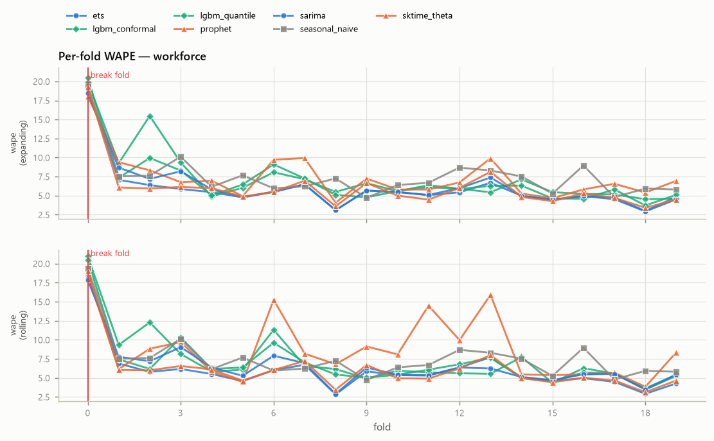
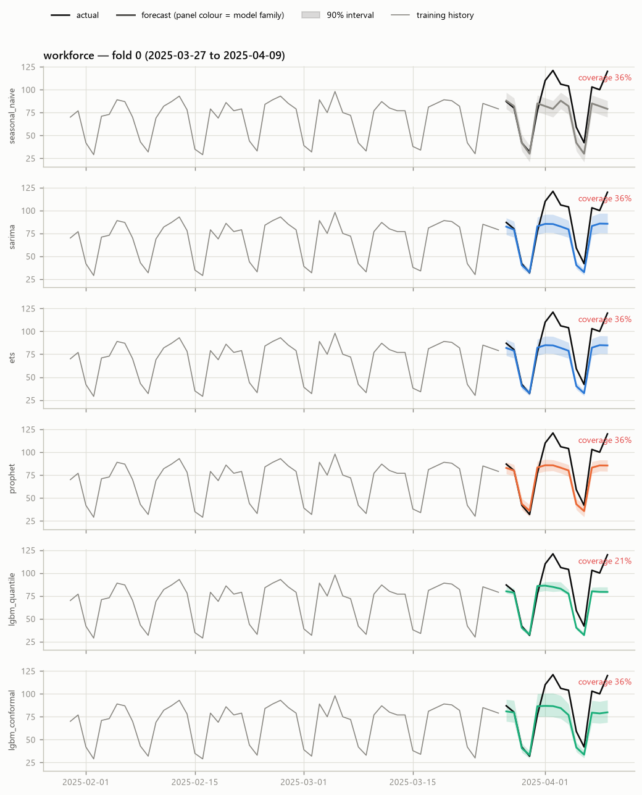
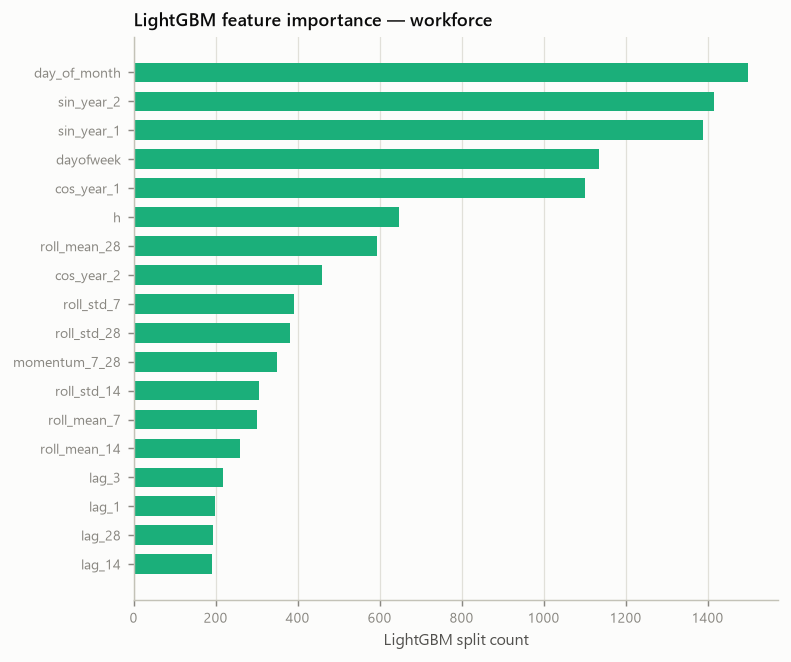

---

## Economic — monthly, one series, 108 points

Monthly non-oil activity index, 2017-2025, 108 points. Linear trend, a 42-month business cycle plus an 11-month harmonic, and a 2020-shaped shock with partial exponential recovery.

`108` observations at `MS`, 2017-01-01 → 2025-12-01,
1 series in the file. Headline scale-free metric:
**MASE**. Target transform: **none**.

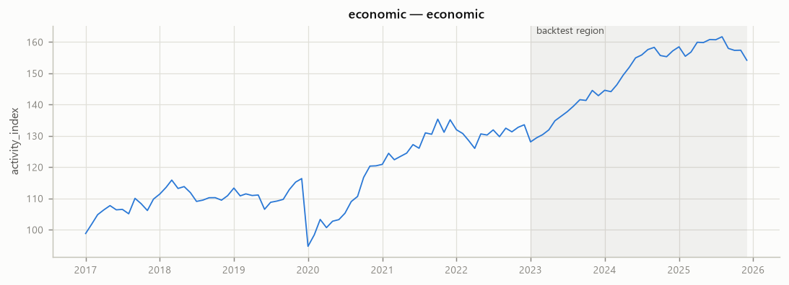
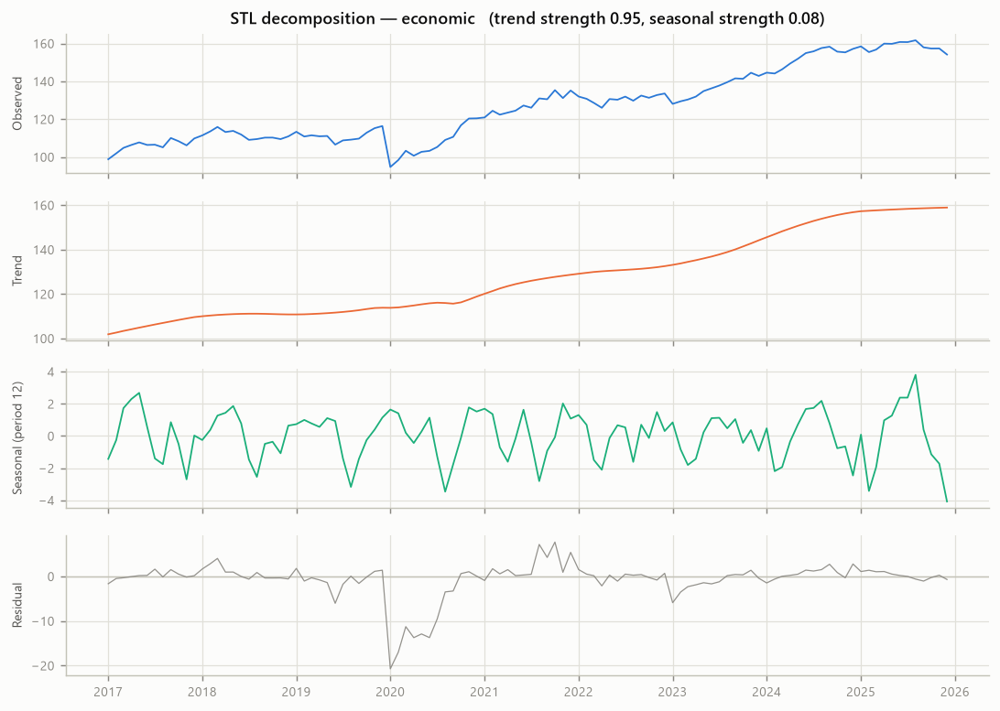
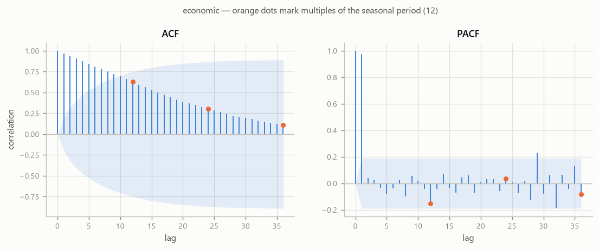

### Structure and diagnostics

- **economic (level)** → *unit root*. ADF p=0.7895 cannot reject a unit root and KPSS p<=0.010 rejects stationarity. Both point the same way: this series needs differencing, so d >= 1.
- **economic (d=1)** → *stationary*. ADF p=0.0000 < 0.05 rejects the unit-root null, and KPSS p>=0.100 fails to reject stationarity. The two tests agree: no further differencing is needed at d=1.
- **economic (seasonal diff, D=1)** → *inconclusive*. After one seasonal difference at lag 12: ADF p=0.0883 cannot reject a unit root, but neither does KPSS p>=0.100 reject stationarity -- the sample is not informative enough to separate the two. Treat d as a modelling choice to be settled by AIC rather than by these tests.

**Decomposition.** STL at period 12: trend strength 0.953, seasonal strength 0.078 (Hyndman F_T/F_S, both in [0,1]; >0.6 is a strong component). |residual| still correlates with the trend at r=0.078 under an additive decomposition versus r=0.217 under a multiplicative one, so the additive form leaves less level-dependence behind. That is the empirical case for fitting on the raw scale without a transform.

**Autocorrelation.** 9 of the first 36 ACF lags and 2 PACF lags exceed the 95% band. Both functions tail off rather than cutting off cleanly (ACF significant through lag 9, PACF through lag 1), which points at a mixed ARMA rather than a pure AR or MA -- so the order is worth selecting by AIC over a small grid rather than read off the plot.

### Model results — expanding window, `economic`

| Model | Family | MAE | RMSE | WAPE % | MASE | Coverage | Width % of mean | Calibration | s / fold |
|---|---|--:|--:|--:|--:|--:|--:|---|--:|
| SARIMA | Classical | 3.412 | 4.327 | 2.29 | 0.379 | 100.0% | 12.9 | over-covers | 1.04 |
| ETS / Holt-Winters | Classical | 3.512 | 4.612 | 2.35 | 0.390 | 100.0% | 11.9 | over-covers | 0.59 |
| LightGBM (quantile) | Tree-based ML | 4.318 | 5.427 | 2.89 | 0.480 | 36.1% | 3.5 | under-covers | 0.61 |
| sktime Theta | GAM / framework | 4.573 | 6.020 | 3.07 | 0.508 | 88.9% | 13.2 | **calibrated** | 0.06 |
| LightGBM (conformal) | Tree-based ML | 4.890 | 6.229 | 3.28 | 0.543 | 80.6% | 13.4 | under-covers | 0.43 |
| Prophet | GAM / framework | 5.632 | 6.893 | 3.78 | 0.626 | 47.2% | 8.2 | under-covers | 1.73 |
| Seasonal naive | Baseline | 9.655 | 11.167 | 6.47 | 1.073 | 100.0% | 26.4 | over-covers | 0.00 |

**Residual diagnostics.** **SARIMA** passed the Ljung-Box white-noise test on 6 of 6 folds (median p = 0.973); **ETS / Holt-Winters** passed the Ljung-Box white-noise test on 6 of 6 folds (median p = 0.765). AIC selected `order=(1, 1, 2)`, `seasonal_order=(0, 0, 1, 12)` on 6 of 6 folds.

Fold-to-fold spread matters more than the mean: **Prophet** ranged from 1.20% to 7.22% WAPE across folds (mean 3.76%, sd 2.16). A single average would have hidden that range entirely.

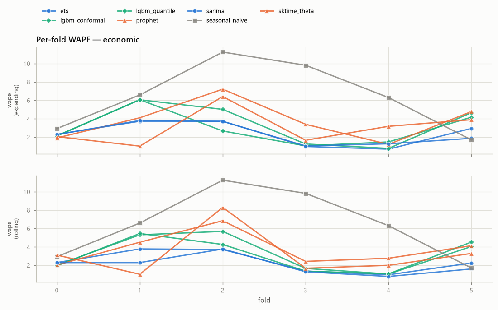
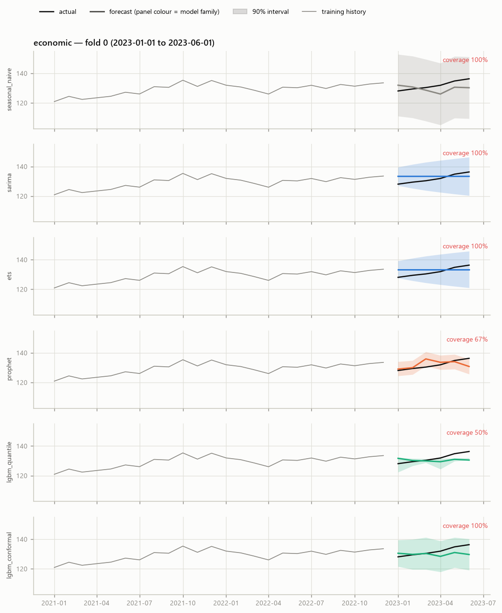
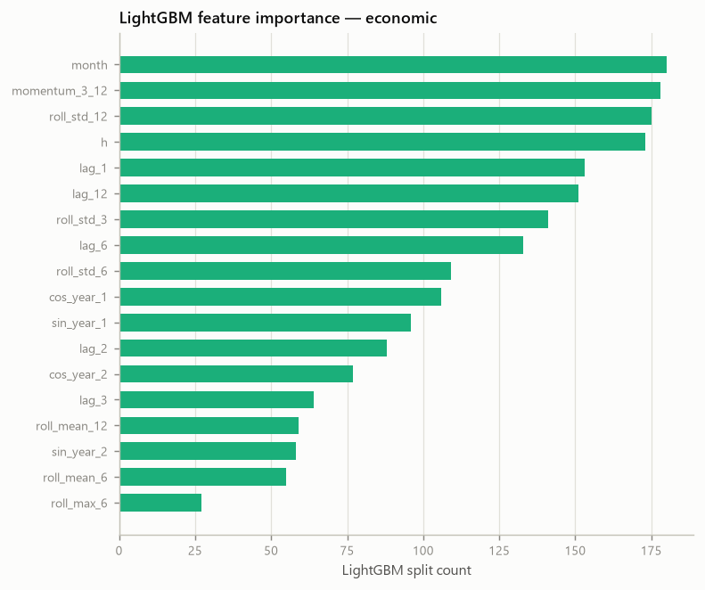

---

## Intermittent — daily, 4 series, 91.7%-97.9% zero rows

Daily spare-parts demand, 4 low-turnover SKUs, 2024-2025. 91.7%-97.9% zero rows depending on SKU; non-zero magnitudes are near-identical across SKUs, so essentially all the signal is *whether* an order occurs, not how large it is.

`731` observations at `D`, 2024-01-01 → 2025-12-31,
4 series in the file. Headline scale-free metric:
**WAPE**. Target transform: **none**.

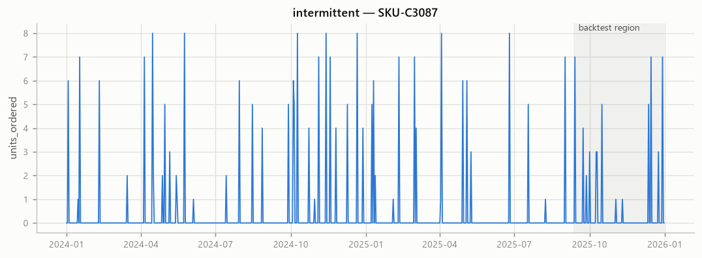
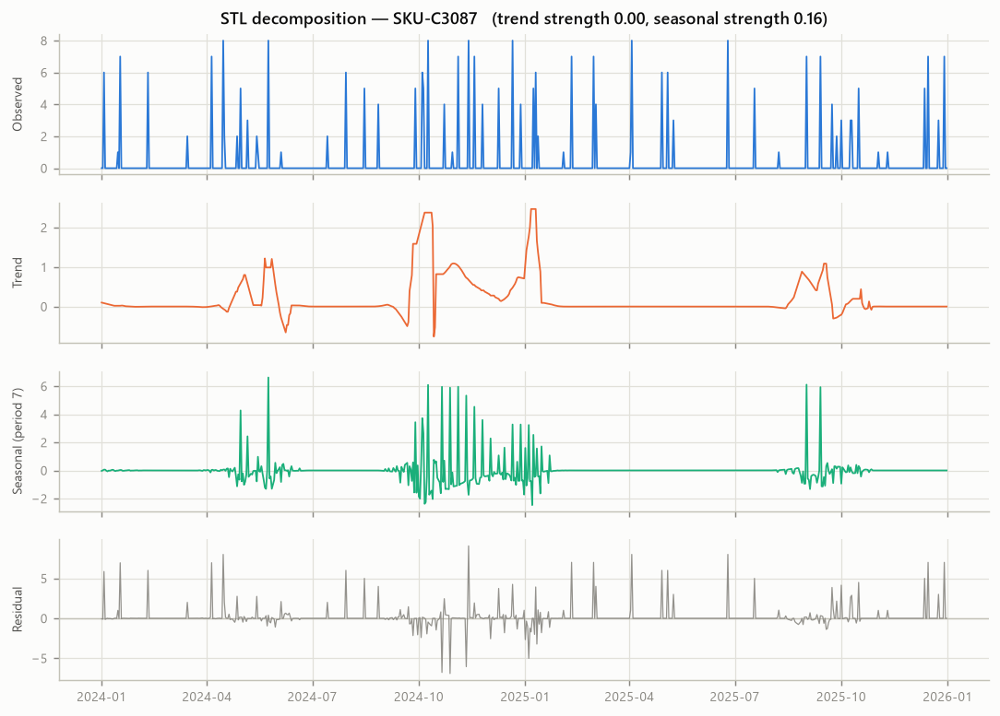
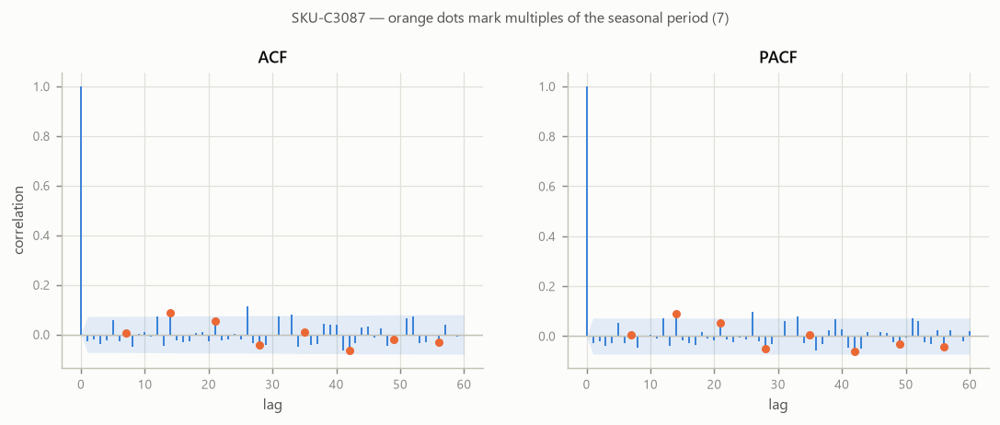

### Structure and diagnostics

- **SKU-C3087 (level)** → *stationary*. ADF p=0.0000 < 0.05 rejects the unit-root null, and KPSS p>=0.100 fails to reject stationarity. The two tests agree: no further differencing is needed at d=0.
- **SKU-C3087 (d=1)** → *stationary*. ADF p=0.0000 < 0.05 rejects the unit-root null, and KPSS p>=0.100 fails to reject stationarity. The two tests agree: no further differencing is needed at d=1.
- **SKU-C3087 (seasonal diff, D=1)** → *stationary*. After one seasonal difference at lag 7: ADF p=0.0000 < 0.05 rejects the unit-root null, and KPSS p>=0.100 fails to reject stationarity. The two tests agree: no further differencing is needed at d=0.

**Decomposition.** STL at period 7: trend strength 0.002, seasonal strength 0.161 (Hyndman F_T/F_S, both in [0,1]; >0.6 is a strong component). A multiplicative decomposition is undefined here (the series contains zeros or negatives), so the additive form is the only option and no variance-stabilising transform is applied.

**Autocorrelation.** 4 of the first 60 ACF lags and 3 PACF lags exceed the 95% band. Significant ACF spikes at lag(s) [14] -- multiples of the seasonal period 7 -- confirm seasonal structure that a non-seasonal ARIMA cannot absorb, so a seasonal term is required.

### Model results — expanding window, `SKU-C3087`

| Model | Family | MAE | RMSE | WAPE % | MASE | Coverage | Width % of mean | Calibration | s / fold |
|---|---|--:|--:|--:|--:|--:|--:|---|--:|
| LightGBM (quantile) | Tree-based ML | 0.603 | 1.541 | 132.51 | 0.889 | 81.2% | 256.0 | under-covers | 2.61 |
| SARIMA | Classical | 0.721 | 1.447 | 158.32 | 1.062 | 91.1% | 588.6 | **calibrated** | 5.48 |
| Seasonal naive | Baseline | 0.723 | 1.864 | 158.82 | 1.065 | 89.3% | 709.8 | **calibrated** | 0.00 |
| sktime Theta | GAM / framework | 0.724 | 1.440 | 158.96 | 1.066 | 91.1% | 590.1 | **calibrated** | 0.07 |
| ETS / Holt-Winters | Classical | 0.742 | 1.442 | 163.05 | 1.094 | 91.1% | 597.2 | **calibrated** | 0.80 |
| LightGBM (global) | Tree-based ML | 0.794 | 1.612 | 174.26 | 1.169 | 57.1% | 111.9 | under-covers | — |
| LightGBM (conformal) | Tree-based ML | 0.897 | 1.704 | 196.99 | 1.321 | 79.5% | 516.6 | under-covers | 1.62 |
| Prophet | GAM / framework | 0.914 | 1.498 | 200.79 | 1.347 | 93.8% | 636.2 | **calibrated** | 0.41 |

**Residual diagnostics.** **SARIMA** passed the Ljung-Box white-noise test on 8 of 8 folds (median p = 0.245); **ETS / Holt-Winters** passed the Ljung-Box white-noise test on 8 of 8 folds (median p = 0.309). AIC selected `order=(1, 0, 2)`, `seasonal_order=(0, 0, 1, 7)` on 8 of 8 folds.

Fold-to-fold spread matters more than the mean: **LightGBM (conformal)** ranged from 85.46% to 1489.56% WAPE across folds (mean 410.97%, sd 518.74). A single average would have hidden that range entirely.

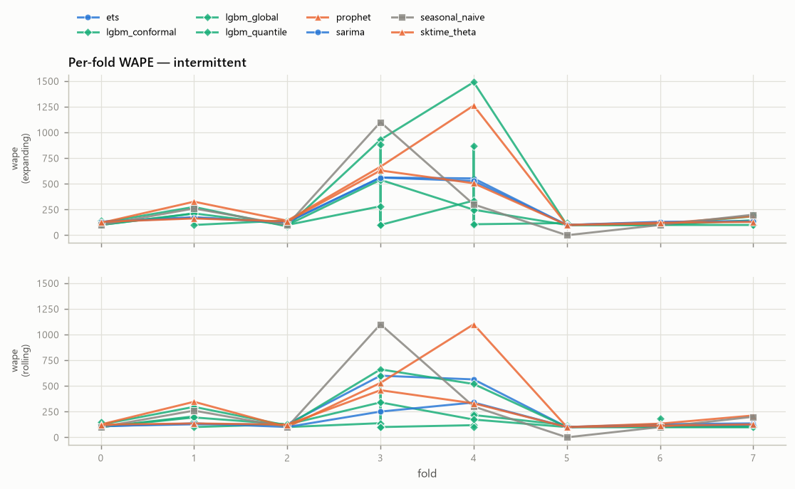
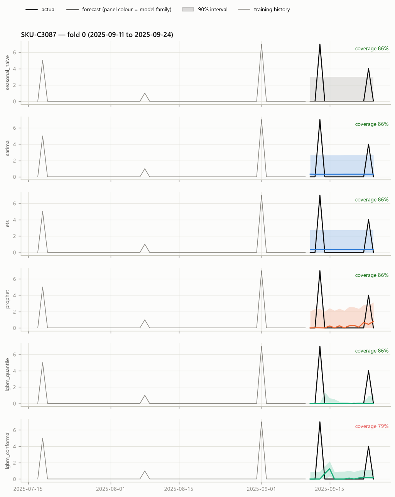
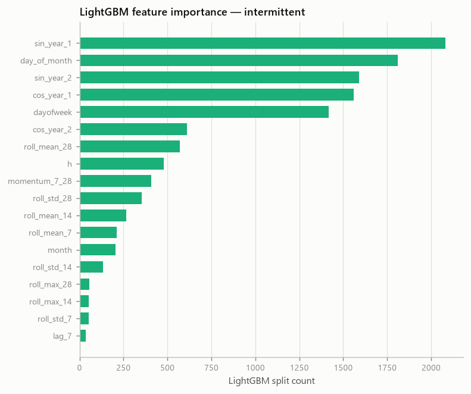

---

## Runs that broke down

1 of 76 scored runs posted a WAPE at least three times its dataset's median. It is named here rather than left to drag an average down
silently — a mean is where a single catastrophic run hides.

| Dataset | Series | Model | Window | WAPE % | vs dataset median | MASE |
|---|---|---|---|--:|--:|--:|
| `retail` | Jeddah/Grocery | LightGBM (global) | rolling | 169.5 | 22.4x | 10.15 |

**Why this one broke.** It is the *global* LightGBM on a rolling
window. A global model pools across series, so a fold whose fixed training
window happens to under-represent one series lets the shared model drift on
that series specifically — and a tree cannot extrapolate, so the drift does not
degrade gracefully. On the Box-Cox scale with a negative lambda, a sufficiently
confident extrapolation leaves the transform's representable range entirely;
the inverse now clips such a forecast to ten times the training maximum and
records the event, which is why this row is bad rather than absurd. Before
that guard existed, this same fold reported a mean absolute error of 6.4e8 on a
series averaging 560 units.

The honest reading is not "LightGBM is unusable here" — its per-series variants
score competitively on the same data. It is that **a global model plus a
rolling window plus a variance-stabilising transform is three extrapolation
risks stacked**, and that combination needs the per-fold monitoring this table
provides rather than a single pooled number.

---

## Does the verdict survive a second window type?

Both window types score the **identical** test windows, so any difference is
attributable to the training window's shape and nothing else.

| Dataset | Models where rolling won | Mean WAPE change (rolling − expanding) | Preferred |
|---|--:|--:|---|
| `economic` | 3/7 | -0.00 | rolling |
| `intermittent` | 9/11 | -6.96 | rolling |
| `retail` | 1/13 | +12.69 | expanding |
| `workforce` | 1/7 | +0.26 | expanding |

Across every dataset and model, rolling won **14 of 38**
paired comparisons. On the series with an actual structural break, rolling beat expanding for **1 of 7** models, with a mean WAPE change of **+0.26 points**. 

**The practical reading.** Expanding is the right default: more history rarely
hurts a model that can use it, and it never discards data. Rolling earns its
place only when older history is *actively misleading* rather than merely
smaller. This backtest is the evidence for which situation you are in — and
notably, it is the same evidence either way, because both window types were run
over the same folds rather than one being chosen in advance.

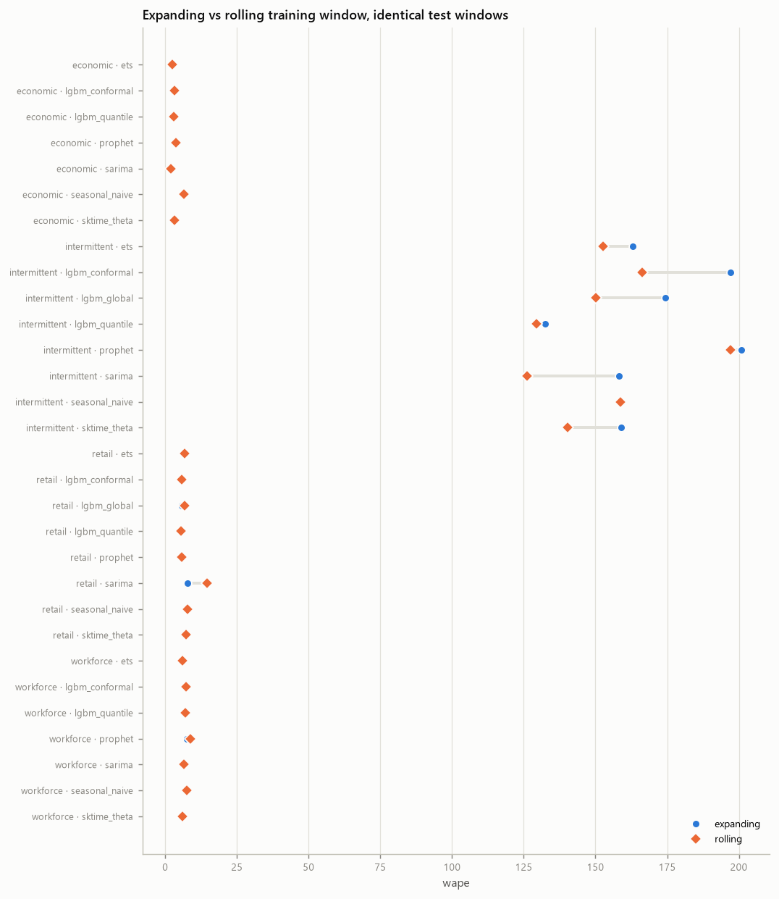

---

## Calibration: did the 90% interval actually cover 90%?

**23 of 76** scored combinations produced an
interval within ±5% of the 90% nominal level.

| Model | Calibrated runs | Mean coverage | Mean width (% of level) | Pinball @0.05 | Pinball @0.95 | Mean pinball |
|---|--:|--:|--:|--:|--:|--:|
| sktime Theta | 5/8 | 91.6% | 169.9 | 2.260 | 2.703 | 2.481 |
| SARIMA | 5/8 | 94.2% | 163.8 | 1.989 | 2.651 | 2.320 |
| ETS / Holt-Winters | 4/8 | 95.6% | 171.7 | 2.164 | 2.449 | 2.306 |
| LightGBM (conformal) | 3/8 | 88.4% | 156.7 | 1.789 | 2.357 | 2.073 |
| Prophet | 2/8 | 75.3% | 176.3 | 3.334 | 3.300 | 3.317 |
| LightGBM (global) | 2/20 | 75.0% | 626.4 | 6.044 | 123.951 | 64.998 |
| Seasonal naive | 2/8 | 93.2% | 226.1 | 3.669 | 3.200 | 3.434 |
| LightGBM (quantile) | 0/8 | 59.7% | 68.9 | 1.615 | 2.901 | 2.258 |

### Pinball loss: scoring the bounds themselves

Coverage and width describe the interval as a pair of lines. **Pinball loss
scores each bound as a forecast in its own right** -- it is to a predicted
quantile what MAE is to a point forecast, and it is the loss LightGBM's
quantile objective is literally trained to minimise, so it is the only metric
here that judges those models on their own terms.

Its asymmetry is the whole idea. At q=0.95 (the upper bound),
under-predicting costs 0.95 x |error| while over-predicting costs
only 0.05 x |error|: the loss is built to prefer a
forecast that sits above the data 95% of the time. At
q=0.05 it is the mirror image. A model can therefore win on
coverage by being lazily wide and still lose badly on pinball -- which is
exactly the diagnostic the coverage/width pair alone cannot give you, because
both bounds are scored individually rather than as a span.

Read the two columns together with coverage: a model whose interval is
well-calibrated *and* whose pinball loss is low has bounds that are both
honest and sharp. One with acceptable coverage but high pinball is covering by
accident.

The worst under-coverage is **LightGBM (quantile)** on `economic` at **36.1%** against a 90% target, with a mean width of only 3.5% of the series' level. That is the dangerous failure: a narrow band that looks confident and is wrong three times more often than it admits. The widest interval is **LightGBM (global)** on `retail` at 3,096.7% of the mean level, covering 100.0% — which is why coverage is never quoted here without width beside it. An interval wide enough covers everything and says nothing.

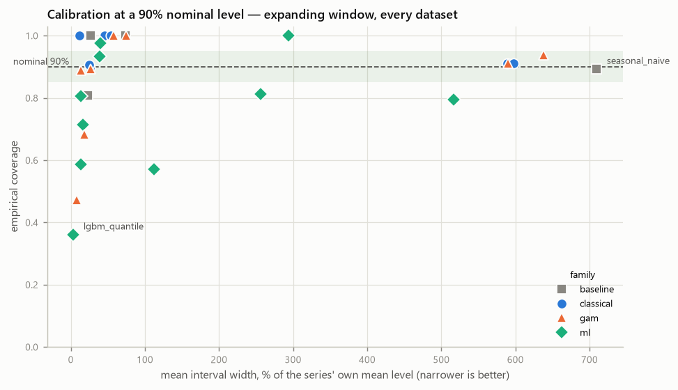

### Where the interval methods differ

The three interval constructions in this project fail in characteristically
different ways, and the pattern is more useful than any single number:

- **Analytic intervals** (SARIMA, ETS) assume the model is correctly specified
  and the residuals Gaussian. When the model fits, they are well-sized; when
  the series shifts regime, they are confidently wrong, because the assumption
  they rest on is the thing that just broke.
- **Prophet's native interval** samples future trend changepoints. It widens
  with horizon, which is right in shape, but in MAP mode it accounts for trend
  and observation noise only — not seasonality uncertainty — and tends to
  under-cover on series whose seasonal amplitude is doing real work.
- **Quantile-objective LightGBM** learns the conditional quantiles of the
  *training* distribution. It is the sharpest of the three and the most
  overconfident: it has no mechanism to widen for a regime it has not seen.
- **Split conformal** makes no distributional assumption — it just asks how
  wrong the model was recently. Recomputing the margin inside every fold, and
  per horizon step rather than pooled, is what keeps it honest; a globally
  computed margin would be narrowest exactly when a break makes it least
  trustworthy.

### Coverage decays with horizon

A pooled coverage number can hit 90% exactly while being far too wide at h=1
and far too narrow at h=14. Only a per-step view shows it, which is why the
conformal margin here is computed per horizon step rather than pooled.

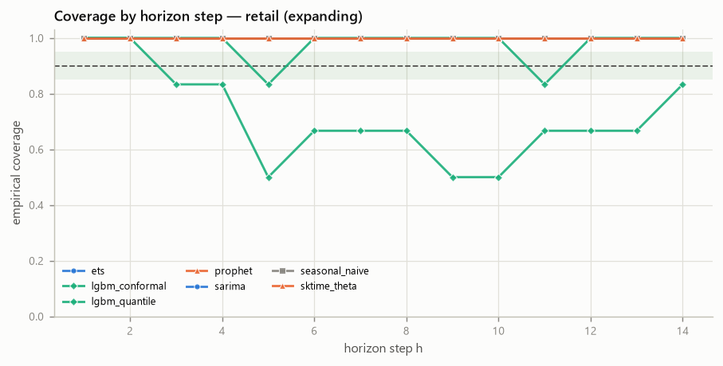
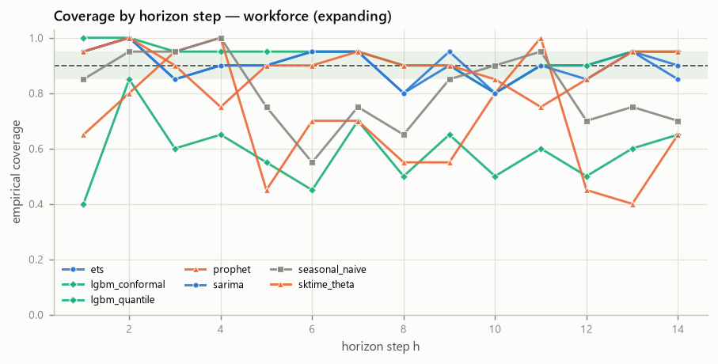
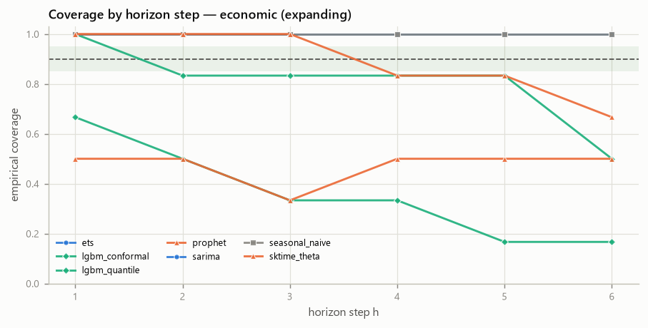
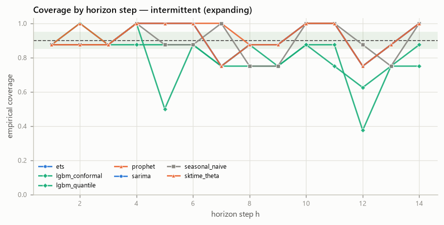

---

## Why the scale-free metric is WAPE, not MAPE, on sparse demand

The metrics cheat sheet makes this argument with a hand-built ten-day window.
This project measured it on its own backtest folds.

| Metric | Median across 176 scored folds |
|---|--:|
| MAE | 0.681 |
| **MAPE** | **2,462,721,760%** |
| sMAPE | 162.4% |
| **WAPE** | **125.2%** |

Across 176 scored folds on a series that is 95.2% zeros, the median fold MAPE is 2,462,721,760% and the worst is 12,142,857,150% -- numbers with no usable interpretation, produced by dividing by actuals that are exactly zero. sMAPE is bounded at 162.4% median, which fails more politely without being more informative. WAPE's median of 125.2% is the only one of the three a planner could act on, because it divides total error by total volume once instead of row by row. 40 fold(s) had an all-zero test window, where even WAPE is only vacuously defined.

MAPE is not merely a worse metric here — it is not a number. It is reported in
this project exactly once, as this demonstration, and never as a score.

---

## Decision framework

### The four tools, measured

Every figure in this table comes from this project's own 76 scored
runs -- not from the tools' documentation and not from the course notes. "The
catch" is the thing that decides against a tool when accuracy alone would not.

| Tool | What it is | Native intervals? | Calibrated runs | Mean coverage | Mean width (% of level) | Median MASE | Median s/fold | The catch |
|---|---|---|--:|--:|--:|--:|--:|---|
| **LightGBM** | Gradient-boosted trees on engineered features | No native interval -- quantile objective or conformal wrapper | 5/36 | 74.6% | 398.1 | 0.792 | 2.14 | Needs the feature pipeline built and leakage-tested yourself |
| **Prophet** | Additive decomposable trend/seasonality/holidays | Yes, native (MAP trend + observation noise) | 2/8 | 75.3% | 176.3 | 0.929 | 0.48 | First-class holiday support; MAP mode omits seasonality uncertainty |
| **sktime** | Uniform fit/predict API over many forecaster families | Yes, uniformly (predict_interval / predict_quantiles) | 5/8 | 91.6% | 169.9 | 0.707 | 0.07 | An abstraction layer; errors surface one step from the cause |
| **statsmodels** | ARIMA/SARIMAX + ETS state space | Yes, analytic | 9/16 | 94.9% | 167.8 | 0.802 | 0.92 | One series at a time; no auto_arima in this toolset |

Accuracy is one axis of four, and on these four series it is rarely the binding
one. The questions that actually decide the choice, in the order they should be
asked:

**1. How much history is there?** This rules tools out before anything else is
considered. The economic series has 108 points *in total*; a `lag_12` feature
costs 11% of it before a single tree is grown, and `mase(..., seasonal_period=12)`
is undefined on the shorter training windows. A classical model estimating a
handful of parameters is not merely a safe choice there — it is the choice the
sample size permits.

**2. Does anyone have to explain the forecast?** ARIMA coefficients and
Prophet's decomposed trend/seasonality/holiday components can be read by a
domain expert who has never seen the code. LightGBM feature importances say
which *columns* mattered, not a story about trend and seasonality anyone can
put in a slide. If a headcount plan has to be defended to a manager, that
consideration outranks a point of WAPE.

**3. Does the decision need a calibrated interval, or just a number?** This is
where the ranking most often changes. A staffing decision is made against the
*upper* bound, not the mean — an interval that under-covers is worse than no
interval, because it manufactures false confidence. statsmodels, Prophet and
sktime hand you an interval by default; LightGBM does not, and "a LightGBM
model with an interval" is a decision to build one, not a default you inherit.

**4. What is the compute budget, and how many series are there?** Per-series
classical fits are cheap individually and scale linearly — a thousand series is
a thousand fits, on every fold, forever. One global tree model amortises
training across every series it covers. At four to six series this is
irrelevant; at four thousand it is the only axis that matters.

### Recommendation per use case

| Use case | History | Family | Model | Fit cost / fold | Interval |
|---|---|---|---|--:|---|
| `retail` | 1,096 @ `D` | GAM / framework | **Prophet** | 0.63 s | over-covers |
| `workforce` | 731 @ `D` | Classical | **ETS / Holt-Winters** | 0.65 s | **calibrated** |
| `economic` | 108 @ `MS` | GAM / framework | **sktime Theta** | 0.06 s | **calibrated** |
| `intermittent` | 731 @ `D` | Classical | **SARIMA** | 5.48 s | **calibrated** |

**Demand planning (retail).** Strong, stable weekly and yearly seasonality with
a modest trend is exactly the shape the classical family was built for, and the
interval comes free and analytic. Reach for a tree model here when you have
*exogenous* signal a classical model cannot absorb — a promo calendar, price,
weather — because that, not raw flexibility, is what it is actually better at.

**Workforce projection.** The model matters less than the validation design.
Every family degrades at the break; what separates them is how fast they
recover and whether their interval widens honestly while they do. Pair a
classical model with a conformal interval recomputed per fold, and monitor
coverage in production as a drift alarm — a calibrated interval that suddenly
stops covering is the earliest signal that the regime moved.

**Economic indicator.** Short and monthly. A few-parameter model, an analytic
interval, and scepticism about anything that claims to have learned a rich
nonlinear structure from 108 points.

**Intermittent spare parts.** None of this course's four tools is the right
tool, and saying so is the honest conclusion rather than a failure to find one.
The signal is almost entirely *whether* an order occurs, not how large it is;
Croston's method and TSB model exactly that — inter-arrival time and demand
size as separate processes — and neither is in this toolbox. What this project
can say with confidence is narrower and still useful: report WAPE, never MAPE;
expect WAPE above 100% and understand why; and treat any model's point forecast
here as a re-order-point input rather than a daily quantity.

---

## Limitations

- **The data is synthetic.** These series were built to exhibit specific
  textures. A model that suits one is evidence about that texture, not about
  real demand.
- **The SARIMA order search is greedy** — two-stage stepwise, 12 fits per fold
  rather than a 32-fit full grid. It can miss a joint optimum. The trade bought
  roughly an hour of runtime and is stated rather than hidden.
- **Croston's method and TSB are not implemented**, so the intermittent
  conclusion is "none of these four tools fits" rather than "here is the model
  that does".
- **Prophet runs in MAP mode**, not MCMC, so its intervals omit seasonality
  uncertainty.
- **Calibration is assessed at one nominal level (90%).** A model calibrated at
  90% is not automatically calibrated at 50% or 99%.
- **One seed.** The generator is deterministic, so this is a study of one
  realisation of each process, not of the process.
- **Fold counts are small on two datasets** (6 folds on retail and economic).
  Per-fold spreads there are indicative, not tight.

---

## Reproducing this

```bash
git clone https://github.com/Abdullah-FZN/calibrated-forecast-backtesting.git
cd calibrated-forecast-backtesting
python -m pip install -r requirements.txt
python -m pytest tests/ -q          # 91 tests
python capstone_pipeline.py         # regenerates every table and figure
python build_report.py              # regenerates this file
```

Artefacts this report is built from:

- [`coverage_by_horizon.csv`](outputs/tables/coverage_by_horizon.csv)
- [`environment.csv`](outputs/tables/environment.csv)
- [`per_fold_metrics.csv`](outputs/tables/per_fold_metrics.csv)
- [`per_fold_summary.csv`](outputs/tables/per_fold_summary.csv)
- [`pooled_metrics.csv`](outputs/tables/pooled_metrics.csv)
- [`report_data.json`](report_data.json) — every number above, machine-readable
- [`outputs/logs/pipeline_run.txt`](outputs/logs/pipeline_run.txt) — the run's console log

*Report generated 2026-09-15 20:31 UTC by
`build_report.py` from a pipeline run of 1259.9s.*
